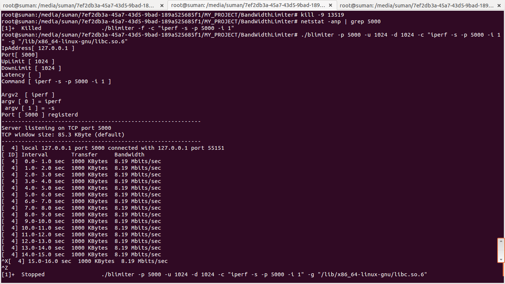

-------------------------------------------------------------
#Bandwidth_Limiter:

BandWidth limiter is a tool to limit the bandwidth of a process in usser space(filtered by port).
 This tool works in linux environment.

------------------------------------------------------------

#Installation:

Pre-requisites
--------------

- gcc

Getting started
--------------
 - To build this project go to PWD:BandWidthLimiter.
 
 - sh make.sh

--------------------------------------------------------

# Execute:

I have used iperf ( a google tool) to test this tool.

1. You can use config file to provide port & limit info [ BandwidthLimiter/limiter.config ]
   Then to launch this tool use the folowing command. 
  [./blimiter -f -c "iperf -s -p 5000 -i 1"]

2. Command line option ( no need of config file )

[./blimiter -p 5000 -u 1024 -d 1024 -c "iperf -s -p 5000 -i 1" -g "/lib/x86_64-linux-gnu/libc.so.6"]

 replace iperf by your own programm. I have tested this tool under tomcat also.

 - you can provide only a single port to filter.

-----------------------------------------------------

#Example

- Server Side
 I have limited server side bandwidth by 1 Mbps

 

- ClientSide:

MY_PROJECT/BandWidthLimiter# iperf -c 127.0.0.1 -p 5000

Client connecting to 127.0.0.1, TCP port 5000
TCP window size: 2.50 MByte (default)

[  3] local 127.0.0.1 port 55151 connected with 127.0.0.1 port 5000
[ ID] Interval       Transfer     Bandwidth
[  3]  0.0-10.0 sec  18.5 MBytes  15.5 Mbits/sec

- without any bandwidth limitation iperf server receives packet by 32.7 Gbits/sec
- I was able to limit the bandwidth under multiple thread also.

---------------------------------------------------

BUG: mail me(email.suman.roy@x.y) where x = gmail
                                  y= com

